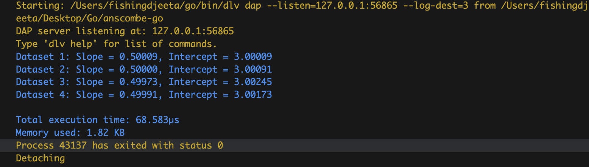
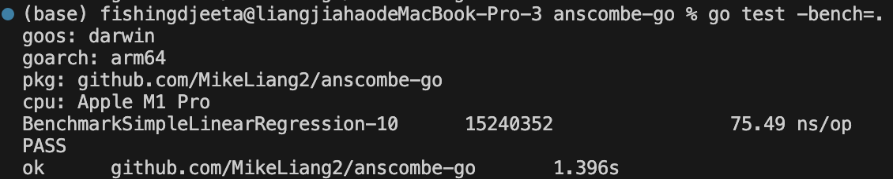
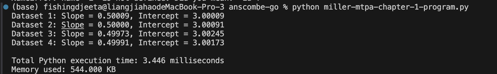
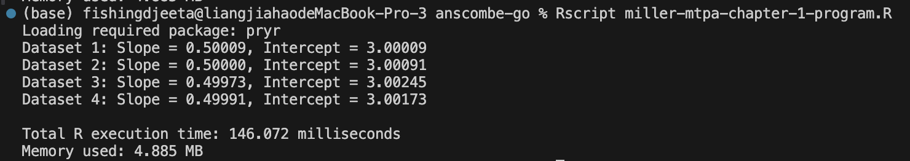

# Anscombe Quartet Regression Analysis and Benchmarking

## Project Overview

This project evaluates the feasibility of using **Go** as a unified language for both basic data science tasks.  
To validate Go's capabilities, we:

- Performed simple linear regression on the **Anscombe Quartet** dataset.
- Compared results and performance across **Go**, **Python**, and **R**.
- Measured both **execution time** and **memory usage**.
- Validated that regression coefficients obtained from Go match those from Python and R.

---

## How to Run

### Go
Using:
go run main.go
go test -bench=.

To run the benchmark test using Go testing unit.

Example and results:

### Python
python miller-mtpa-chapter-1-program.py

Example and results:

### R
Rscript miller-mtpa-chapter-1-program.R

Example and results:

## Results Summary

Execution Time and Memory Usage

| Language | Measurement           | Execution Time | Memory Usage |
|:--------:|:----------------------:|:--------------:|:------------:|
| Go (Benchmark) | Average per operation | 75.08 ns/op    | -            |
| Go (Full run)  | Single execution       | 84.208 µs      | 1.82 KB      |
| Python         | Single execution       | 3.446 ms       | 544 KB       |
| R              | Single execution       | 146.072 ms     | 4.885 MB     |

## Regression Coefficients Comparison
All three languages produced consistent regression results (slope and intercept) for the Anscombe Quartet datasets, confirming the accuracy of Go’s statistical computations.

## Observations
Go has the fastest execution speed and smallest memory footprint by a large margin.

Python provides rich statistical libraries and moderate performance.

R excels at statistical modeling but has higher memory and time costs for basic operations.

# Management Recommendation
## Performance: 
Go is highly efficient for basic statistical operations, making it ideal for integration with backend systems and cloud services.

## Memory Efficiency: 
Go's lightweight memory usage is suitable for high-concurrency, large-scale environments.

## Statistical Needs: 
For projects requiring advanced statistical modeling, Python or R should be selectively used.

## Team Alignment: 
Adopting Go as the primary language can streamline collaboration between software engineers and data scientists, especially when statistical requirements are relatively basic.

## Final Recommendation:
In term of performance and efficiency, it is better to use Go as the default language for backend services and standard statistical analyses. However, Python and R is still feasible considering usage habits, project environment, and other factors for complex data science and machine learning tasks.

## Notes on Testing
Go benchmarks (go test -bench) report nanoseconds per operation and should not be directly compared to Python/R script runtime without understanding the difference in measurement methods.

Python and R timings reflect total script execution, including data setup, regression, and plotting.

